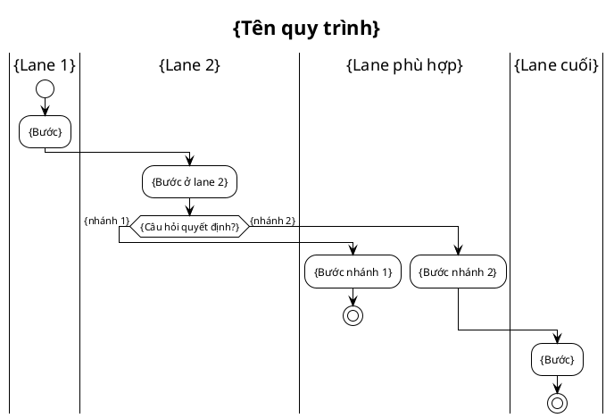

Base directory for this skill: /Volumes/Data/AI4BAv2/english-ai-demo/.claude/skills/activity-swimlane

# /activity-swimlane — Activity Diagram với Swimlane thật (PlantUML)

> Họ diagram activity 3 lựa chọn: `/activity` (Mermaid, nhúng inline auto-render GitHub/Obsidian) · `/d2-activity` (D2+ELK, hình đẹp standalone) · `/activity-swimlane` (PlantUML, **swimlane thật** cho luồng đa-vai-trò nhiều cross-lane). Cần chuẩn OMG import Camunda → `/bpmn`.

## Goal

Vẽ 1 quy trình nghiệp vụ đa vai trò thành activity diagram có **swimlane thật** bằng [PlantUML](https://plantuml.com) `|Lane|` syntax: mỗi vai trò 1 lane thẳng cột cố định, node "nhảy" sang lane của actor chịu trách nhiệm, decision hình lục giác chuẩn UML. Render qua plantuml.com (không cần Java local).

**Tại sao cần skill này bên cạnh `/activity` + `/d2-activity`:** luồng đa-vai-trò nhiều tương tác qua lại (vd refund: Khách ↔ Hệ thống ↔ Agent ↔ Quản lý liên tục) làm **Mermaid subgraph** xô lệch (subgraph chỉ là khung trang trí, node trôi tự do) và **D2/ELK** kéo lane ra xa nhét đường thành "mì Ý". PlantUML `|Lane|` giữ lane thẳng cột **cố định**, layout engine của nó chuyên cho swimlane activity — đây là công cụ đúng cho loại luồng này.

**Output** (2 nơi, theo lựa chọn user 2026-07-12):
1. Source + ảnh trong `srs/`: `docs/{feature}/srs/{feature}-{slug}-swimlane.puml` (source, git được) + `.svg` (render sẵn).
2. Section nhúng ảnh trong `srs/{feature}-flows.md`: `## Flow: {title} (Swimlane)` chứa `` + Trigger/Related — cùng file với `/activity`, `/sequence`.

## Constraints

- **Output cố định**: `.puml`+`.svg` trong `srs/`, section nhúng ảnh trong `srs/{feature}-flows.md`. KHÔNG flag layout/theme/direction.
- **Render qua plantuml.com** (`render.sh`) — máy này KHÔNG có Java. **TRADE-OFF**: nội dung diagram (tên lane/bước) gửi qua internet mỗi lần render. Nội dung nhạy cảm → không dùng skill này (xem Gotchas).
- **AI viết source .puml, KHÔNG tự tính toạ độ** — PlantUML layout engine lo. Vai trò AI = mô tả đúng nghiệp vụ (lane/bước/nhánh/loop).
- **Compile phải PASS** trước khi báo xong. `render.sh` bắt cả lỗi HTTP lẫn "Syntax Error" nhúng trong SVG. Fail → sửa source, render lại (tối đa 2 lần).
- **TỰ XEM LẠI ẢNH sau render** (bước bắt buộc — xem Approach 7) — render `.png` rồi Read ảnh, tự soi mũi tên/lane/dead-end **trước** khi báo user. Đây là cách bắt lỗi "mũi tên hiển thị không đúng" mà compile-check bỏ sót.
- **L1 approval** trước Write — prose BA-friendly (xem `ba-conventions.md` Mục 5), từ nghiệp vụ (các bước / nhánh / vai trò), KHÔNG dump source PlantUML.
- **KHÔNG L3 iterate** — PlantUML không render trong chat; user review từ `.svg`. (Skill TỰ review qua ảnh PNG ở bước 7 thay cho user.)
- **Vietnamese-first** trong label (PlantUML hỗ trợ Unicode); keyword cú pháp English.
- **`--feature` optional** — auto-detect từ ngữ cảnh; mơ hồ mới hỏi. **Feature chưa có + arg là mô tả quy trình → tự derive slug + tạo feature** (điểm-vào, `feature-bootstrap.md` nhóm A).
- **Idempotent** — slug đã tồn tại → tự vào update mode (L2 diff cho .puml + section flows.md), re-render.

## Công thức chuẩn (yêu cầu bắt buộc mọi diagram — đúc từ prompt IT-BA chuẩn)

Mọi swimlane diagram skill sinh ra PHẢI thoả:

1. **Swimlane theo vai trò** — mỗi role 1 lane `|Tên lane|`, đề xuất lane từ process + user flow.
2. **Start rõ ràng** (`start`) + **mọi nhánh có end** (`stop` hoặc `end`) — KHÔNG loose end.
3. **Phủ đủ** mọi activity, decision, outcome từ nguồn nghiệp vụ.
4. **Decision yes/no** (`if (...) then (...) else (...) endif`) ở mọi điểm rẽ.
5. **Tương tác giữa lane** thể hiện qua việc node chuyển lane (`|Lane khác|` trước activity).
6. **Flow logic + đầy đủ, no loose ends** — mọi node có đường ra tới 1 end.
7. **Note cho step phức tạp** (`note right: ...`) khi cần làm rõ.
8. **Default colors** — KHÔNG tô màu tùy biến (dùng `!theme plain` cho nền sạch).
9. **TRÁNH dấu ngoặc kép `"..."`** trong syntax — PlantUML activity không cần quote label; quote gây lỗi parse. Label tiếng Việt/space/dấu để trần.
10. **Layout sạch, không rối** — node đặt logic, hạn chế mũi tên cắt chéo (xem Gotchas mũi tên).

## Inputs

```
/activity-swimlane "<mô tả quy trình>" --feature <slug>     # tạo mới
/activity-swimlane --feature <slug>                          # interactive: hỏi vẽ quy trình nào
/activity-swimlane "<mô tả quy trình của feature mới>"        # feature chưa có → derive slug + phỏng vấn + tạo (điểm-vào)
```

Trùng slug đã tồn tại → skill tự vào update mode (L2 diff), không cần gõ thêm.

## Context (dynamic)

```bash
echo "Today: $(date +%F)"
echo "Features có sẵn:"; ls -d docs/*/ 2>/dev/null | sed 's|docs/||;s|/||' | grep -v '^_'
echo "Features đã có swimlane .puml:"; ls docs/*/srs/*-swimlane.puml 2>/dev/null | sed 's|docs/\([^/]*\)/.*|\1|' | sort -u || echo "(chưa có)"
echo "python3:"; command -v python3 >/dev/null && echo "✅" || echo "❌ THIẾU — skill cần python3 encode"
echo "internet plantuml.com:"; curl -s -o /dev/null -w "%{http_code}" --max-time 5 https://www.plantuml.com/plantuml/ 2>/dev/null || echo "unreachable"
```

## Flow runtime (skill chạy thế nào)

```
User gọi /activity-swimlane "<mô tả>" --feature X
   │
   ▼
1. Resolve feature + process slug (verb-object kebab-case từ mô tả, max 40 chars)
   │  ┌─ Feature chưa khớp docs/{feature}/ (điểm-vào, feature-bootstrap.md nhóm A):
   │  │  arg là mô tả quy trình → derive feature slug, confirm ở L1, tạo docs/{feature}/srs/ khi Write.
   │  │  arg là slug-lạ 1 từ → hỏi "feature mới hay gõ nhầm?" (liệt kê feature hiện có).
   │  └─ python3/internet thiếu → dừng, báo 1 dòng (xem Context). KHÔNG ghi file rỗng.
   ▼
2. Đọc nguồn nghiệp vụ:
   │  ┌─ Đã có: đọc brainstorms/*.md (Decision Points, State Transitions), srs/{feature}-spec.md,
   │  │  usecases/uc-*.md → lấy bước/nhánh/lane/loop, no-re-ask cái đã có.
   │  └─ CHƯA có nguồn: phỏng vấn ĐÚNG PHẠM VI (feature-bootstrap.md nhóm A bước 3), 1 batch
   │     business-language: các bước tuần tự · điểm quyết định (câu hỏi + nhánh yes/no) · lanes
   │     (ai làm bước nào) · loop (retry/quay lại). KHÔNG hỏi DB/SDK. KHÔNG bịa.
   ▼
3. Xác định: lanes | bước mỗi lane | decision (yes/no) | loop/parallel | outcome mỗi nhánh
   ▼
3.5. Xác nhận lane TRƯỚC khi vẽ (BẮT BUỘC nếu ≥1 lane) — in "Phát hiện {N} vai trò: {list}. Đủ chưa?"
   │  Actor ẩn/ngụ ý trong câu văn dễ bị bỏ sót — chờ user xác nhận/bổ sung.
   ▼
4. Trích fact-list (giữ trong context): lanes · mỗi decision + nhánh · outcome mỗi nhánh phải tới 1 stop.
   ▼
5. Viết source .puml (công thức bên dưới) — AI mô tả cấu trúc, KHÔNG toạ độ. Tuân 10 điểm "Công thức chuẩn".
   ▼
6. L1 plan preview (prose BA-friendly: N bước, M decision, K lane). User Y → tiếp.
   ▼
7. Write .puml → render.sh --png → SVG + PNG.
   │  compile/syntax fail? → đọc lỗi, sửa source, render lại (tối đa 2 lần).
   │  → RỒI Read file .png: TỰ SOI mũi tên đúng hướng? lane đúng? mọi nhánh tới stop? không đè?
   │    Phát hiện lỗi hiển thị → sửa .puml, re-render, re-xem (tối đa 2 vòng). Xem checklist bước 7.
   ▼
8. Append section vào srs/{feature}-flows.md (nhúng ). flows.md chưa có → tạo skeleton.
   ▼
9. Coverage-verify: mỗi decision fact-list thành 1 if/else? mỗi lane thành 1 |Lane|? mọi nhánh tới stop?
   │  Thiếu → bổ sung .puml, re-render + re-xem, tối đa 2 lần.
   ▼
10. Update srs/{feature}-flows.md updated + env note → activity.log. Báo user mở .svg.
```

## Cách xây (build step-by-step)

### Bước 1 — Công thức viết source .puml (swimlane activity)



**Quy tắc VÀNG để mũi tên/lane đúng (đây là chỗ hay sai nhất):**

- **`|Lane|` đặt NGAY TRƯỚC `:activity;` thuộc lane đó** — KHÔNG đặt sau, KHÔNG gom nhiều `|Lane|` liền nhau. Sai vị trí = mũi tên nhảy lane sai chỗ.
- **Bên trong mỗi nhánh if/else, PHẢI khai báo lại `|Lane|`** trước activity nếu bước đó ở lane khác — PlantUML không tự nhớ lane trong nhánh.
- **Mọi nhánh phải kết bằng `stop`** (nếu là end riêng) HOẶC hội tụ tự nhiên sau `endif` (chảy tiếp xuống). KHÔNG để nhánh trống.
- **Nhánh `if` chỉ 1 phía có `stop`**: nhánh kia KHÔNG cần `stop` — nó chảy tiếp sau `endif`. Đặt `stop` cả 2 nhánh khi cả 2 là end thật.
- **Loop (retry)** — dùng `repeat`/`repeat while (...)` cho retry-until, hoặc `while (...) is (...) ... endwhile`. TRÁNH tự nối backward `->` thủ công (dễ vẽ mũi tên rối). Mẫu retry đơn giản:
  ```plantuml
  repeat
    :Gọi Stripe hoàn tiền;
  repeat while (Thất bại và chưa đủ 3 lần?) is (Có) not (Không)
  ```
- **Loop có BƯỚC XỬ LÝ khi quay lại** (vd "ghế đã đặt → báo lỗi → chọn lại") — dùng `backward:` trong khối repeat để vẽ bước chạy trên đường quay về:
  ```plantuml
  repeat
    :Chọn ghế;
    backward:Báo lỗi Ghế không khả dụng, chọn lại;
  repeat while (Ghế đã có người đặt?) is (Đã đặt) not (Còn trống)
  ```
  `backward:` render mũi tên loop gọn + có label bước, đẹp hơn tự nối. (Xem `references/example-movie-booking.puml`.)
- **TUYỆT ĐỐI KHÔNG dùng `goto`/`label`** — beta feature KHÔNG render mũi tên nối (đã verify: `goto` tạo node treo/dead-end). Nhánh cần "nhảy" tới đoạn chung (vd cả 2 nhánh D5 từ chối đều dẫn tới "thông báo khách + quota") → CHẤP NHẬN lặp code đoạn chung trong mỗi nhánh, thà lặp còn hơn dead-end. Đừng thử `goto`.
- **Chuyển lane trong loop** cũng phải khai báo `|Lane|` mỗi lần.
- **Decision >2 nhánh** — PlantUML activity if/else chỉ 2 nhánh; ≥3 nhánh dùng `if ... elseif (...) then ... else ... endif`.
- **KHÔNG dùng `"..."`** bọc label (yêu cầu #9). Ký tự đặc biệt trong label như `«»`, `:` — `«»` OK không quote; dấu `:` trong label PHẢI escape hoặc tránh (kết thúc activity là `;`, nhưng `:` giữa label thường OK — nếu compile fail vì `:`, đổi thành gạch ngang).
- **`note`** cho step phức tạp: `note right`\n`nội dung nhiều dòng`\n`end note` — đặt ngay sau activity cần chú thích.

### Bước 2 — Render + tự verify

```bash
.claude/skills/activity-swimlane/render.sh docs/{feature}/srs/{feature}-{slug}-swimlane.puml --png
# fail → đọc lỗi (HTTP hoặc "Syntax Error" trong SVG), sửa source, chạy lại.
# PASS → Read file .png, tự soi (checklist bước 7). Lỗi hiển thị → sửa .puml, re-render.
```

### Bước 3 — Section trong flows.md

```markdown
## Flow: {Title} (Swimlane)
**Trigger**: {1-line}
**Related UC**: [[../usecases/uc-{slug}.md]] (nếu có, else TBD)
**Related FR**: {ids hoặc TBD}


> Nguồn PlantUML: `{feature}-{slug}-swimlane.puml`. Sửa .puml → chạy `render.sh` regen .svg.
```

## Bước 7 — Checklist TỰ XEM LẠI ẢNH (giải quyết "mũi tên hiển thị không đúng")

Sau render PASS, Read file `.png` và tự soi TỪNG mục (đây là điều user yêu cầu: check → demo → tự review → update):

- [ ] **Hướng mũi tên**: mọi mũi tên chảy đúng chiều tiến trình (không có mũi tên ngược bất thường trừ loop có chủ đích).
- [ ] **Lane đúng chủ thể**: mỗi node nằm trong lane của actor THỰC SỰ làm bước đó (vd "Gọi Stripe" phải ở lane Hệ thống, không phải Khách hàng).
- [ ] **Không nhánh cụt**: mọi đường dẫn tới 1 `stop`/`end`. Nhìn ảnh không thấy node nào "treo" không có đường ra.
- [ ] **Decision đủ 2 nhánh**: mỗi hình lục giác có đúng 2 (hoặc n) đường ra có nhãn.
- [ ] **Loop đúng**: mũi tên retry quay về đúng node, có điều kiện thoát.
- [ ] **Không đè/rối nặng**: đường không chồng lên nhau tới mức không đọc được. Nếu quá rối → cân nhắc tách 2 diagram hoặc giảm cross-lane.

Lỗi bất kỳ mục → sửa `.puml`, re-render `--png`, re-xem. Tối đa 2 vòng. Vẫn lỗi sau 2 vòng → báo user rõ mục nào chưa đạt + đề xuất (tách diagram / sửa mô tả), KHÔNG âm thầm báo "xong".

## L1 plan preview (mẫu BA-friendly)

> Em sẽ vẽ **swimlane diagram** cho quy trình **{tên}** (PlantUML, lane thật):
>
> **Nội dung:**
> - {K} lane vai trò: {liệt kê}
> - {N} bước xử lý, {M} nhánh quyết định (vd "Đơn hợp lệ?", "Stripe thành công?")
> - Điểm bắt đầu: {...}; các điểm kết thúc: {...}
> - {loop/note nếu có}
>
> **Ghi vào:** source `srs/{feature}-{slug}-swimlane.puml` + ảnh `.svg`, nhúng section vào `srs/{feature}-flows.md`.
>
> **Ghi nhận:** activity log "{note}".
>
> Apply? (Y / sửa)

## Output report

```
✅ Swimlane diagram: docs/{feature}/srs/{feature}-{slug}-swimlane.svg
   Lane: {K} | Bước: {N} | Decision: {M} | Compile: OK | Tự-review ảnh: PASS
   Section nhúng: docs/{feature}/srs/{feature}-flows.md → ## Flow: {title} (Swimlane)

Mở .svg (hoặc section trong flows.md) để xem swimlane render.
Cần sửa? /activity-swimlane "<thay đổi>" --feature {feature} (skill tự vào update mode).
```

## Gotchas

- **python3 / internet thiếu** → dừng ngay bước 1, in đúng 1 dòng. KHÔNG ghi file rỗng.
- **Nội dung nhạy cảm** — render gửi tên lane/bước qua plantuml.com. Nhạy cảm → KHÔNG dùng skill này (cài Java + plantuml.jar local để offline, ngoài scope skill).
- **Mũi tên nhảy lane sai** (lỗi #1 hay gặp) — do `|Lane|` đặt sai vị trí (phải NGAY TRƯỚC activity) hoặc quên khai báo lại `|Lane|` bên trong nhánh if/else. Xem "Quy tắc vàng" bước 1. Bước 7 tự-xem-ảnh bắt được lỗi này.
- **Nhánh cụt** — if/else thiếu `stop` ở nhánh là end, hoặc quên `endif`. Compile có thể vẫn PASS nhưng ảnh lộ node treo → bước 7 bắt.
- **Loop rối** — tự nối backward `->` thủ công dễ vẽ mũi tên chồng chéo. Dùng `repeat/repeat while` hoặc `while/endwhile` (bước 1). ≥2 loop lồng → tách 2 diagram.
- **`"..."` gây lỗi** — PlantUML activity KHÔNG cần quote. Bọc quote label tiếng Việt = compile fail hoặc render sai. Để label trần (yêu cầu #9).
- **Dấu `:` trong label** — activity mở bằng `:` đóng bằng `;`. Dấu `:` GIỮA label thường OK, nhưng nếu compile fail → thay bằng gạch ngang/word.
- **Syntax Error nhúng trong SVG** — plantuml.com trả HTTP 200 kèm ảnh chứa text lỗi. `render.sh` đã grep bắt "Syntax Error" → exit non-0. Đừng bỏ qua.
- **Đừng tự chốt lane từ heuristic** — bước 3.5 bắt buộc hỏi user xác nhận lane trước khi vẽ.
- **Đừng over-engineer** — flow 3-4 bước 1 lane tuyến tính không cần swimlane; `/activity` hoặc numbered steps đủ. Swimlane phát huy khi ≥2 lane + nhiều cross-lane.
- **Không trộn/xoá bản khác** — nếu feature đã có `/activity` (Mermaid) hoặc `/d2-activity` trong flows.md/d2, skill này thêm section riêng, KHÔNG xoá bản kia. Nhiều view của cùng flow là hợp lệ.
- **Update mode (slug tồn tại)** → Read .puml cũ, L2 diff phần sửa, re-render sau khi user Y, cập nhật cả section flows.md.
- **Path ảnh trong flows.md** — viết tương đối với vị trí flows.md (ở `srs/`), tức `` (cùng thư mục). `/preview` và `/export` TỰ ĐỘNG xử lý ảnh này:
  - `/preview` + `/export --format html`: inline SVG vào HTML (self-contained, path-proof, có zoom modal). SVG được normalize (bỏ `preserveAspectRatio="none"` + width/height cứng, giữ viewBox) nên KHÔNG méo khi hiển thị inline.
  - `/export --format pdf|docx`: đổi `.svg` → `.png` trong assets (ưu tiên PNG có sẵn cạnh .svg — nên KHÔNG cần xoá .png sau render; else convert qua Chrome). pandoc nhúng PNG vào PDF/DOCX.
  - **Nên GIỮ file `.png` cạnh `.svg`** (render.sh --png sinh cả 2) — export PDF/DOCX dùng lại PNG này, khỏi convert lại.

## References

- @../../rules/ba-conventions.md
- @../../rules/approval-gate.md
- @../../rules/naming-conventions.md
- @../../rules/changelog.md
- @../../rules/diagram-selection.md
- @../../rules/feature-bootstrap.md
- @./render.sh (render qua plantuml.com — bước 7)
- @./plantuml_encode.py (encode PlantUML text → URL, dùng bởi render.sh)
- @./references/example-movie-booking.puml (mẫu chuẩn đã verify: 2 lane, 3 loop retry dùng `repeat while` + `backward:`, mọi nhánh tới stop — tham chiếu cách viết loop có bước xử lý giữa chừng)
