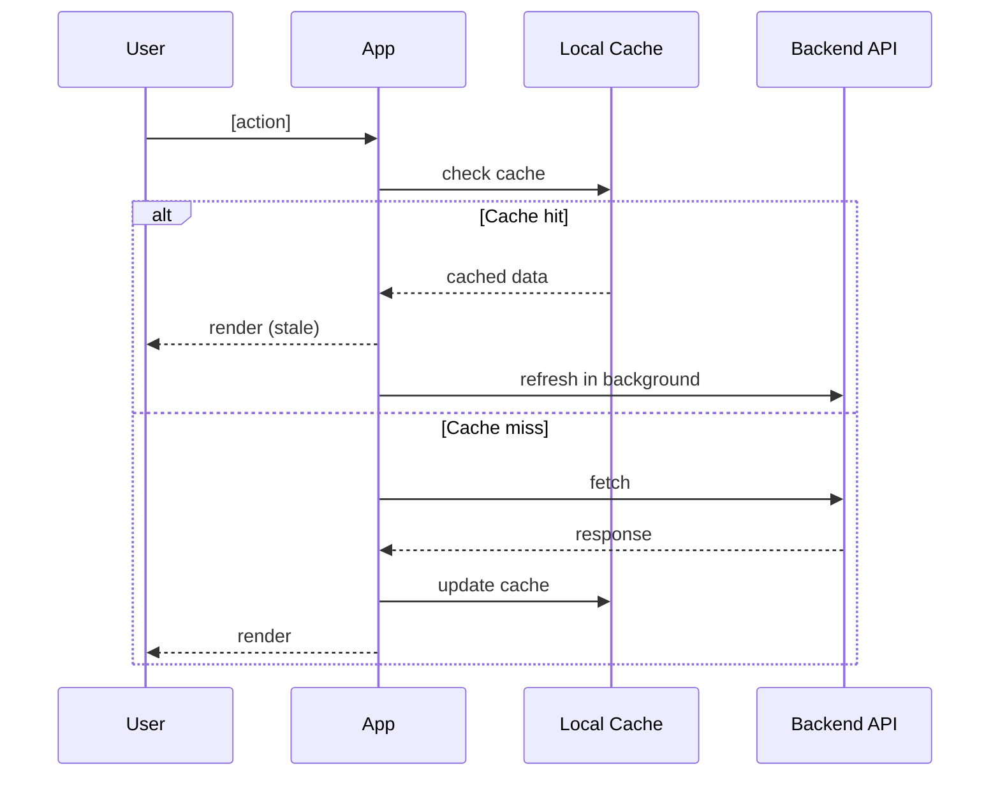

# BA Spec — App (Flutter / Mobile)
<!-- Dùng cùng _base.md. -->

Chuẩn: BABOK v3 · ISO/IEC/IEEE 29119-3
Format: Markdown → playground → sub-task file local (Distribution)

**Sections trong file này** (phần còn lại lấy từ `_base.md`):

| # | Section | Ghi chú |
|---|---------|---------|
| 1 | Tổng quan — bổ sung | Scope mobile (màn hình / flow trong scope) |
| 3 | API Mapping | Endpoint + Offline/Retry (bắt buộc) |
| 4 | Screen / State Spec | Navigation + state transitions + offline fallback |
| 5 | Interaction Diagram | User / App / API / Cache |
| 7 | Definition of Done — bổ sung | App checklist |

---

## Section 1 — Bổ sung (App)

| Scope mobile | Danh sách màn hình / flow trong scope |

---

## Section 3 — API Mapping

Cột Offline/Retry là bắt buộc — ghi rõ behavior khi mất mạng hoặc API lỗi.

| Màn hình / Action | Endpoint | Request | Response | Offline / Retry |
|-------------------|----------|---------|----------|-----------------|

Khi endpoint chưa xác định → dùng gate trước khi tiếp tục:

```
AskUserQuestion · single-select
question : "Endpoint cho [action] chưa có trong wiki/Nexus.
            Thiếu thông tin này Section 3 không hoàn chỉnh — dev không thể implement đúng."
options  :
  - label: "Cung cấp endpoint ngay"
    description: "Nhập method + path + response shape"
  - label: "Tra cứu Nexus thêm"
    description: "Tìm API contract hiện có"
  - label: "Ghi pending — tạo Open Question"
    description: "Tiếp tục spec, ghi vào Section 8 Điểm cần confirm"
```

---

## Section 4 — Screen / State Spec

Ghi navigation path, state transitions, và offline fallback per màn hình.

> ⚠️ **Không chỉ định lifecycle method cụ thể của Flutter** (VD: `initState`, `didChangeDependencies`, `addPostFrameCallback`, `didMount`…) trong BA Spec — đây là implementation detail của Dev.
> BA Spec chỉ mô tả **khi nào** hành vi xảy ra (VD: *"sau khi màn hình ready / sau frame đầu tiên"*, *"khi user quay lại tab"*), không mô tả **bằng hook nào**.
> Tương tự: không chỉ định tên class, tên method nội bộ, hay pattern cụ thể (BLoC, Provider, Riverpod…) — trừ khi là contract public API giữa hai màn hình.

| Màn hình | Navigation | States | Offline fallback | Error handling |
|----------|------------|--------|------------------|----------------|

---

## Section 5 — Interaction Diagram



Điều chỉnh theo chiến lược cache thực tế. Thêm nhánh retry / offline nếu có.

---

## Section 7 — Definition of Done (bổ sung App)

- [ ] Offline behavior đúng spec — hiển thị cache hoặc thông báo rõ khi mất mạng
- [ ] Retry logic hoạt động đúng khi API lỗi tạm thời
- [ ] Tích hợp API đúng mapping Section 3
- [ ] Pass trên device matrix mục tiêu (iOS + Android nếu cả hai)
