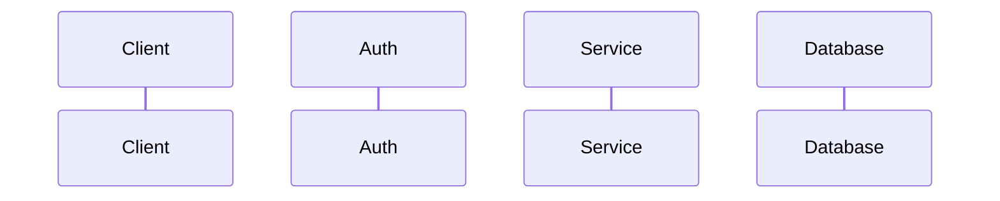

# BA Spec — Backend
<!-- Dùng cùng _base.md. Áp dụng cho mọi BE stack: NestJS, Laravel, Node.js. -->

Chuẩn: BABOK v3 · OpenAPI 3.0 · ISO/IEC/IEEE 29119-3
Format: Markdown → playground → sub-task file local (Distribution)

**Sections trong file này** (phần còn lại lấy từ `_base.md`):

| # | Section | Ghi chú |
|---|---------|---------|
| 1 | Tổng quan — bổ sung | Tech stack, Base URL, Auth, Depends on |
| 3 | API Contract (OpenAPI 3.0) | YAML block per endpoint |
| 4 | DB Schema + Migration | SQL up/down, index |
| 5 | Sequence Diagram | Auth → Service → DB |
| 7 | Definition of Done — bổ sung | BE checklist |

---

## Section 1 — Bổ sung (Backend)

| Tech stack  | [NestJS / Laravel / Node.js] · [PostgreSQL / MySQL] · [Queue nếu có] |
| Base URL    | Lấy từ auth middleware spec (xem WIKI CONTEXT → Auth Middleware). Không tự đặt prefix. Nếu WIKI CONTEXT có [AUTH-MIDDLEWARE-NOT-FOUND] → xem gate bên dưới trước khi điền. |
| Auth convention | Lấy từ auth middleware spec — ghi rõ US key local hoặc spec reference. |
| Depends on  | |
| Consumed by | |

---

## Section 3 — API Contract (OpenAPI 3.0)

Mỗi endpoint 1 YAML block. Xóa key không dùng — không giữ key rỗng.

```yaml
# {METHOD} {/api/v1/{prefix}/{path}}
method: GET|POST|PATCH|DELETE
path: /api/v1/{prefix}/{resource}
auth: Creator token | Staff token | Public
roles: []                 # xóa nếu không có role check
request:
  path_params: {}         # xóa nếu không có
  query_params: {}        # xóa nếu POST/PATCH
  body:                   # xóa nếu GET
    required: []
    properties: {}
responses:
  200: {}
  401: { message: Unauthenticated }
  403: { message: Forbidden }
  422: { errors: { field: "error message" } }
security: []              # rate_limit, IP whitelist — xóa nếu không có
```

Cursor pagination (feed, history):
```yaml
response_200:
  data: []
  next_cursor: string | null
```

Offset pagination (admin table):
```yaml
response_200:
  data: []
  meta: { total: integer, page: integer, limit: integer }
```

**Gate — Auth Middleware Not Found (BẮT BUỘC trước khi viết bất kỳ path nào):**

```
Kích hoạt khi: WIKI CONTEXT có [AUTH-MIDDLEWARE-NOT-FOUND]

AskUserQuestion · single-select
question : "⛔ OQ CRITICAL — Auth middleware spec chưa xác định.
            Prefix endpoint sai sẽ khiến auth guard reject toàn bộ request.

            Cần biết: route prefix nào → auth strategy nào trong project này?
            VD: /api/v1/cms/* → Admin JWT, /api/v1/app/* → Creator JWT

            👤 Cần confirm với: Tech Lead / BE Lead của project"
options  :
  - label: "Cung cấp mapping ngay"
    description: "Nhập prefix → auth mapping để ghi vào Section 1 và Section 8"
  - label: "Chưa có — tạm hoãn spec"
    description: "Dừng lại. Tạo OQ CRITICAL trong Section 8, không distribute cho đến khi resolve."
```

> Khi resolve: ghi prefix đã xác nhận vào `Base URL` + `Auth convention` trong Section 1,
> thêm dependency row vào Section 8 trỏ về auth middleware spec.
> Không tiếp tục viết Section 3 cho đến khi gate này pass.

Khi endpoint chưa xác định → dùng gate trước khi tiếp tục:

```
AskUserQuestion · single-select
question : "Endpoint cho [action] chưa có trong wiki/Nexus.
            Thiếu thông tin này Section 3 không hoàn chỉnh — dev không thể implement đúng."
options  :
  - label: "Cung cấp endpoint ngay"
    description: "Nhập method + path + request/response schema"
  - label: "Tra cứu Nexus thêm"
    description: "Tìm API contract hiện có"
  - label: "Ghi pending — tạo Open Question"
    description: "Tiếp tục spec, ghi vào Section 8 Điểm cần confirm"
```

---

## Section 4 — DB Schema + Migration

Chỉ ghi bảng mới / cột thay đổi. Schema không thay đổi → không ghi lại.
Table prefix: `{prefix}_` — tra Nexus hoặc dùng `ba-db-schema`.

```sql
-- up()
CREATE TABLE {prefix}_{table} (...);

-- down()  ← bắt buộc
DROP TABLE IF EXISTS {prefix}_{table};

-- Migration: breaking change | backward compatible
```

Index (nếu có NFR performance):
```sql
-- B-tree composite
CREATE INDEX {idx_name} ON {table} (col1, col2 DESC) WHERE deleted_at IS NULL;
-- GIN trigram (ILIKE search — cần pg_trgm)
CREATE INDEX {idx_name} ON {table} USING GIN (col gin_trgm_ops) WHERE deleted_at IS NULL;
```

> Khi cần tạo bảng mới: gọi skill `ba-db-schema`.
> Cột mới trên table lớn: nullable trước, backfill sau.

---

## Section 5 — Sequence Diagram



Luồng tối thiểu: Auth verify → Service → DB.
Thêm Queue / External service nếu có. Bỏ step không có trong flow thực tế.

---

## Section 7 — Definition of Done (bổ sung Backend)

- [ ] API response khớp contract Section 3 — shape, status code, error format
- [ ] Auth enforced đúng per endpoint — endpoint nhạy cảm không public
- [ ] Migration có `down()` rollback; chạy không lỗi trên staging
- [ ] Index tạo trên staging nếu Section 4 có khai báo
- [ ] Không break existing endpoints (backward compatible)
- [ ] Unit / integration test pass
