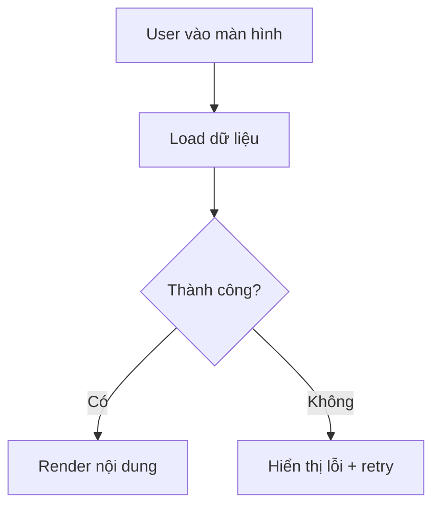

# BA Spec — Web (Next.js / React)
<!-- Dùng cùng _base.md. -->

Chuẩn: BABOK v3 · ISO/IEC/IEEE 29119-3
Format: Markdown → playground → sub-task file local (Distribution)

**Sections trong file này** (phần còn lại lấy từ `_base.md`):

| # | Section | Ghi chú |
|---|---------|---------|
| 1 | Tổng quan — bổ sung | Scope UI (màn hình trong scope) |
| 3 | API Mapping | Endpoint + error/empty/retry state |
| 4 | UI/Component Spec | Layout type + component list |
| 5 | User Flow Diagram | Flowchart các nhánh chính |
| 7 | Definition of Done — bổ sung | Web checklist |

---

## Section 1 — Bổ sung (Web)

| Scope UI | Danh sách màn hình / component trong scope |

---

## Section 3 — API Mapping

Mỗi dòng = 1 màn hình / action. Bắt buộc mô tả loading / empty / error / retry state.

| Màn hình / Action | Endpoint | Request | Response | Error handling |
|-------------------|----------|---------|----------|----------------|

Khi endpoint chưa xác định → dùng gate trước khi tiếp tục:

```
AskUserQuestion · single-select
question : "Endpoint cho [action] chưa có trong wiki/Nexus.
            Thiếu thông tin này Section 3 không hoàn chỉnh — dev không thể implement đúng."
options  :
  - label: "Cung cấp endpoint ngay"
    description: "Nhập method + path + response shape"
  - label: "Tra cứu Nexus thêm"
    description: "Tìm API contract hiện có"
  - label: "Ghi pending — tạo Open Question"
    description: "Tiếp tục spec, ghi vào Section 8 Điểm cần confirm"
```

---

## Section 4 — UI/Component Spec

### 4.0 — Layout Type

| | |
|-|-|
| **Layout Type** | `Full height` (sidebar + fixed panels) / `Scroll theo trang` (table, form, settings) |
| **Lý do** | [giải thích ngắn] |
| **Sidebar menu** | Thêm vào group `[Tên module]` / Không cần |
| **Header change** | Không thay đổi / Cần thêm [mô tả] |

### 4.1 — Component List

| Màn hình | Component | Trách nhiệm | Empty / Error state |
|----------|-----------|-------------|---------------------|

---

## Section 5 — User Flow Diagram



Các nhánh bắt buộc: success / error / empty / retry.

---

## Section 7 — Definition of Done (bổ sung Web)

- [ ] Loading / empty / error / retry states đầy đủ theo Section 3
- [ ] Tích hợp API đúng mapping Section 3 — method, path, params
- [ ] Không break existing layout / menu khi thêm màn hình mới
